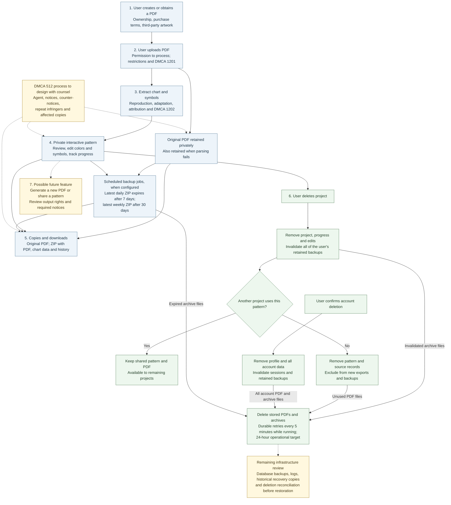

**Stitch Helper: PDF lifecycle and copyright discussion**

The diagram and notes reflect the implemented [retention and deletion policy](DATA-RETENTION.md), including last-project source cleanup, backup invalidation, and account deletion. Remaining infrastructure retention and restoration questions are marked for review.

Prepared September 9, 2026, for the September 10 attorney meeting. U.S. copyright and DMCA are the starting point; confirm the relevant jurisdictions and launch markets with counsel.

The current app accepts PDFs a user created or obtained elsewhere and builds a private interactive stitching chart. The code reviewed does not generate a new pattern PDF. It returns the original PDF and generates ZIP exports containing original PDFs and extracted chart data. A future PDF-generation or sharing feature is shown separately.

Solid arrows describe the implemented flow. Dotted arrows mark future features or legal and infrastructure questions for discussion. The diagram describes the local code reviewed, not an audit of deployed infrastructure.

**Questions to take through the lifecycle**

| Stage | Ask the attorney |
| --- | --- |
| **1. Source and permission** | How should we distinguish a user's original design, a purchased pattern, and a design based on someone else's artwork or character? Does a typical personal-use purchase license permit uploading to a commercial cloud service? What limited processing license and user representations should our terms require? Discuss reproduction and adaptation rights under [17 U.S.C. §§ 103 and 106](https://www.copyright.gov/title17/92chap1.html). |
| **2. Upload and PDF restrictions** | What is the policy for password-protected PDFs, extraction/copy restrictions, and user-supplied passwords? Have counsel assess access controls separately from copy controls and any applicable exception under [§ 1201](https://www.copyright.gov/title17/92chap12.html). The current import code has no password-entry or deliberate unlocking feature; its PDF library's behavior with permissions flags still needs verification. |
| **3. Extraction and attribution** | Does reconstructing the chart, extracting embedded symbol-font outlines, or replacing symbols require permission? What designer names, copyright notices, license terms, or watermarks should accompany the extracted chart and exports? Discuss the knowledge and intent requirements of [§ 1202, copyright management information](https://www.copyright.gov/title17/92chap12.html). The original PDF is preserved, but the extracted model has no dedicated attribution or license fields. |
| **4. Private use and business model** | How does private progress tracking affect the analysis of copying a complete chart? How would subscriptions, marketing, or a substitute for the publisher's digital product change the analysis? Assess the four factors rather than assuming personal use or format conversion settles fair use. [Copyright Office fair-use guidance](https://www.copyright.gov/fair-use/). |
| **5. Storage, backups and downloads** | What authorization covers server copies, cloud vendors, browser delivery, original-PDF downloads, and ZIPs containing a reconstructable chart? Do those copies require particular notices or restrictions? What should the user agreement say about downloaded copies and subsequent redistribution? Review these uses against [§ 106](https://www.copyright.gov/title17/92chap1.html). |
| **6. Deletion and complaints** | Review permanent project/account deletion, preservation of sources still used by another project, immediate backup invalidation, and the 24-hour operational file-cleanup target. What additional steps should a copyright complaint trigger if other projects use the same work? Set retention periods for infrastructure backups and logs, and a process for legal holds and reconciliation of deletions before restoration. |
| **7. Generated PDFs or sharing** | If we add a new PDF export, what may it contain: full chart, changed colors/symbols, progress overlay, original artwork, attribution? What rights could attach to user edits, and what underlying rights remain? Would public links, social screenshots, printing, or selling outputs require different permissions or product limits? Review before defining the feature. |
| **Across all stages: DMCA safe harbor** | Which activities, if any, qualify under § 512, especially user-directed storage and associated processing? Discuss designated-agent registration and publication; notice intake; expeditious removal/disabled access; counter-notices and statutory restoration timing; a reasonably implemented repeat-infringer policy; standard technical measures; knowledge, control and financial-benefit issues; and privacy when disclosing user information. Safe harbor eligibility needs its own assessment. [Copyright Office § 512 resources](https://www.copyright.gov/512/) and [statutory text](https://www.copyright.gov/title17/92chap5.html). |

**Current facts worth emphasizing**

- **The application-level retention gap is fixed.** Project deletion removes its progress and edits and invalidates all of the owner's retained backup archives. Deleting the last project using a pattern also removes its pattern, import and source records; new exports exclude that removed content. Sources still used by another project remain available to that project.
- **File cleanup survives failures.** Stored PDFs and invalidated/expired archives are queued durably for deletion. Cleanup is attempted promptly, with retries every five minutes while the service runs and a 24-hour operational target. Outages or storage failures can delay completion. Copies already downloaded or being streamed cannot be recalled.
- **Account deletion is implemented.** Confirmed deletion removes the profile, Google sign-in association, projects, PDFs, progress, inventory, preferences and retained backups from the account. Other sessions are rejected on their next authenticated request; stored files use the same cleanup queue.
- **Failed parsing still retains the PDF while its project exists.** Unreadable imports follow the same last-project and account deletion policy.
- **Access is scoped to the signed-in owner in the reviewed routes.** There is no implemented public pattern-sharing route in this flow. This describes access controls; counsel should still evaluate the underlying copying and processing.
- **App backup expiry is enforced.** When jobs run, the latest daily archive is available for up to seven days and the latest weekly archive for up to 30 days. Expired archives cannot be downloaded even if physical cleanup is delayed. Future archives contain only remaining account data.
- **Infrastructure retention and restoration still need review.** The supported cloud-storage configuration allows up to seven additional days of soft-delete recovery after file cleanup. Existing object holds and historical recovery copies need an operator audit. Database/PITR backup and log retention periods remain to be finalized, and automatic reconciliation of deletions after infrastructure restoration is not implemented. These remaining questions do not mean deleted content remains available through the app's normal export routes.
- **No dedicated complaint/takedown workflow was found in the reviewed application routes.** Ask counsel to specify both the policy and the operational controls needed for the original and every accessible representation.

Implementation references: [upload, original delivery and exports](../server/Program.cs), [ownership checks and project deletion](../server/Repository.cs), [shared-source cleanup and backup invalidation](../server/ContentLifetime.cs), [account deletion and retry worker](../server/RetentionService.cs), [ZIP contents and retention](../server/BackupService.cs), [private object storage](../server/AssetStorage.cs), [extracted chart data model](../server/Domain.cs), and [symbol-font extraction](../server/ChartTableImporter.cs). The [retention policy](DATA-RETENTION.md) details the remaining infrastructure and legal-policy work.

Bring a representative purchased PDF and its purchase/license terms, a user-created example, screenshots of the interactive chart, a sample ZIP export, and any planned pricing or sharing features. Ask for a concrete launch checklist: permitted uses, required permissions, terms and copyright policy, DMCA operations, retention rules, and features requiring further review.
