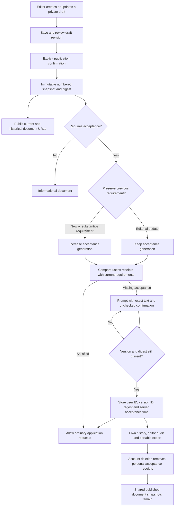

# Data model, API, and lifecycle

## Storage and consistency

`LegalDocuments` is the generic registry plus one mutable draft per slug. `DraftRevision` is a concurrency token. Save and publish both require the caller's reviewed revision; publication increments it to prevent replayed publication.

`LegalVersions` stores immutable snapshots with a unique `(DocumentSlug, Version)` pair. Each snapshot includes title, body, publication summary, checkbox wording, whether acceptance is required, acceptance generation, publication timestamp, and digest. Current means the highest version for that slug. PostgreSQL triggers reject updates and deletes; there is no unpublish endpoint. These guards protect normal writes, not a privileged database administrator who can disable them.

The SHA-256 digest covers UTF-8 serialization of the snapshot's slug, version, title, body, summary, acceptance wording, requirement flag, and acceptance generation using the application's JSON serializer. It is an integrity identifier, not an independent digital signature or third-party timestamp. Publication IDs/timestamps are stored alongside it.

`LegalAcceptances` has primary key `(UserId, VersionId)` with a server timestamp and the snapshot digest. Updates are rejected by a database trigger; account deletion may remove receipts. No IP address or user-agent is collected. A duplicate current-version submission succeeds without changing the original timestamp. The user's latest accepted version is derived from immutable receipts; publishing never manufactures acceptance.

Required versions use monotonically increasing acceptance generations. Editorial versions can share the previous required generation. Informational versions use generation zero; re-enabling a requirement increments the maximum historical generation, preventing an old receipt from satisfying the new requirement.

Publication, draft saves, and acceptance commits share a PostgreSQL transaction advisory lock across instances. Acceptance validates the entire submitted batch against current version IDs and digests before inserting any receipt. If publication wins the lock first, stale acceptance fails with HTTP 409. If acceptance commits first, it remains valid evidence for that version, and a later substantive publication immediately creates a new outstanding requirement. Acceptance also acquires the owner's content-lifetime lock, so account deletion cannot be followed by resurrection of receipts.

## Enforcement and user experience

Ordinary authenticated `/api` requests check current requirements and return HTTP 428 if acceptance is outstanding. Requests already past this check can finish; this is request-boundary enforcement. There is no grace period. The UI checks before mounting the workspace, every 60 seconds, on focus, and on HTTP 428. An update overlays a native modal dialog while preserving the mounted workspace and its queued unsaved changes. Actions rejected with 428 are not automatically replayed; users can retry after acceptance.

Each required document shows the exact historical snapshot fetched for its version, the publication summary, and its own unchecked checkbox. Changes to pending version IDs reset confirmations. Acceptance is authenticated, protected by the same antiforgery mechanism as other writes, and cannot supply another user ID or a client-controlled timestamp. API clients can submit a subset of up to 50 documents atomically; outstanding requirements continue to block ordinary app use.

Reading public documents, `/api/me`, antiforgery bootstrap, own legal status/history/acceptance, editor management, signing out, exporting current data, and deleting the account remain available while acceptance is pending. Editor endpoints independently enforce database role membership. No role is granted by the frontend.

## API surface

All paths below start with `/api`. Responses containing account information and all other API responses use `Cache-Control: no-store`.

| Method and path | Access and purpose |
| --- | --- |
| `GET /legal/documents` | Public current-version summaries |
| `GET /legal/documents/{slug}` | Public current full snapshot |
| `GET /legal/documents/{slug}/versions` | Public published history summaries |
| `GET /legal/documents/{slug}/versions/{version}` | Public exact full snapshot |
| `GET /legal/status` | Current signed-in user's last acceptance and outstanding requirements |
| `GET /legal/history` | Current user's receipts with full accepted snapshots |
| `POST /legal/accept` | `{ documents: [{ versionId, contentSha256 }] }` |
| `GET /admin/legal/drafts` | Editor-only drafts |
| `POST /admin/legal/drafts/{slug}` | Editor creates a draft with revision 0 |
| `PUT /admin/legal/drafts/{slug}` | Editor saves with expected `revision` |
| `POST /admin/legal/drafts/{slug}/publish` | Editor publishes reviewed `{ revision }` |
| `POST /admin/legal/audit` | Editor searches `{ query: "exact email or account GUID" }`; lookup data stays out of URL logs |

Draft input: `revision`, `title`, `body`, `changeSummary`, `acceptanceText`, `requiresAcceptance`, and `requireReacceptance` (defaults true). Authentication failures use 401, missing editor access 403, invalid input 400, missing snapshots 404, and stale revisions/snapshots 409.

## Retention and export

Account deletion cascades to all of that user's acceptance receipts. The existing deletion process also invalidates retained backup archives containing them. Deleting a project does not remove account-level acceptance history. Exports and scheduled application backups include `data/legal-acceptances.json`: receipts with the exact accepted snapshots, digest, and acceptance timestamp. The manifest includes its count and file checksum. This is an additive section in backup format version 1.

Public published versions are retained indefinitely as shared document history and contain no acceptance account association. The current policy deliberately does not retain personal acceptance evidence after account deletion. If counsel requires a separate evidence-retention period or legal holds, that requires an explicit policy and implementation change; do not claim such retention already exists.

Infrastructure database backups and operational logs retain the limitations in [DATA-RETENTION.md](../DATA-RETENTION.md). This feature does not close the independent deletion-ledger or infrastructure-restore reconciliation gap. Restoring an old database could restore old receipts and old current-document versions; reconcile deletions and publication history before resuming traffic.
